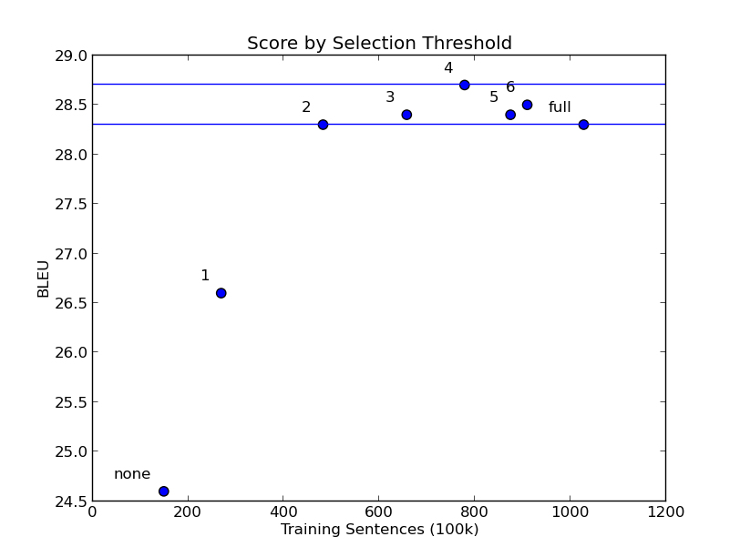

NOTE: some tools in cdec have changed since qe-clean was developed.  Use the following to ensure you have the version of cdec that qe-clean expects:
```
git clone https://github.com/redpony/cdec.git cdec-old
cd cdec-old
git reset --hard bf10ad9d1d3a17ae82804f947616db89f41d4f28
```

qe-clean
========

qe-clean uses data cleaning techniques inspired by machine translation quality estimation.

**qe-clean and the required cdec framework are released under the GNU LGPL license.  See the included COPYING file.**

Results:
--------

WMT 2013 Russian--English data:
* News commentary (clean): 149k sentences
* Common crawl (noisy): 878k sentences



Compared to using all data:
* Comparable score with 38% of noisy data (2 stdev)
* Better score with 72% of noisy data (4 stdev)

About:
------

qe-clean uses the word aligner written by Chris Dyer and the language modeling library written by Kenneth Heafield.
If you use qe-clean, please cite the following:

@InProceedings{cmu-avenue-wmt12,
  author    = {Michael Denkowski and Greg Hanneman and Alon Lavie},
  title     = {The CMU-Avenue French-English Translation System},
  booktitle = {Proceedings of the NAACL 2012 Workshop on Statistical Machine Translation},
  year      = {2012},
}

@InProceedings{cdec,
author      = {Chris Dyer and Adam Lopez and Juri Ganitkevitch and Johnathan Weese and Ferhan Ture and Phil Blunsom and Hendra Setiawan and Vladimir Eidelman and Philip Resnik},
title       = {cdec: A Decoder, Alignment, and Learning Framework for Finite-State and Context-Free Translation Models},
booktitle   = {Proceedings of the Association for Computational Linguistics (ACL)},
year        = {2010},
}

@InProceedings{kenlm,
author      = {Kenneth Heafield},
title       = {{KenLM}: Faster and Smaller Language Model Queries},
booktitle   = {Proceedings of the Sixth Workshop on Statistical Machine Translation},
year        = {2011},
}

qe-clean uses word alignments (word-based translation models) and language models to find sentence pairs that are likely to be good translations of one another.

Data selection features:
* source N-gram language model
* target N-gram language model
* source-target word alignment scores
* source-target aligned word ratio
* target-source word alignment scores
* target-source aligned word ratio

Thresholds for data selection are found by scoring known good (clean) data, such as development sets.
A threshold of 2 standard deviations works well in practice.  Up to 4 standard deviations may improve score at cost of larger models.

Dependencies:
-------------

cdec: http://www.cdec-decoder.org/

Usage:
------

### Clean Data Available:

Monolingual data, one sentence per line:
* Source (f) mono: large monolingual data for language model estimation
* Target (e) mono: large monolingual data for language model estimation

Bilingual data, one sentence pair per line, delimited by triple pipe |||:
* Clean data: known (relatively) good bilingual data to build alignment models (ideally at least 2 million sentences, more may help but not strictly needed)
* Dev data: small high quality bilingual data (such as dev sets, ideally 5000 sentences or more)
* Input data: large noisy data to be cleaned

To automatically run all model estimation and scoring sequentially:
```
qe-clean.py -f mono.f -e mono.e -b clean.f-e -d dev.f-e -i input.f-e -o work
```

To get a list of commands that can be run manually in parallel:
```
qe-clean.py -f mono.f -e mono.e -b clean.f-e -d dev.f-e -i input.f-e -o work -c
```

After input has been scored, select by standard deviation (for example, 2):
```
tools/select.py 2 < work/input.scored >| input.2std.f-e
```

### Limited Clean Data Available:

Alternatively, if only a clean development set is available, models can be built from the large, noisy data and used to exclude outliers.
```
qe-clean.py -f mono.f -e mono.e -b input.f-e -d dev.f-e -i input.f-e -o work
```

### Fully Unsupervised

As a technical point, the monolingual source and target data can be both sides of the input data as well as the dev set, making data selection fully unsupervised.
This is known not to work as well but may be better than nothing.

```
qe-clean.py -f input.f -e input.e -b input.f-e -d input.f-e -i input.f-e -o work
```
